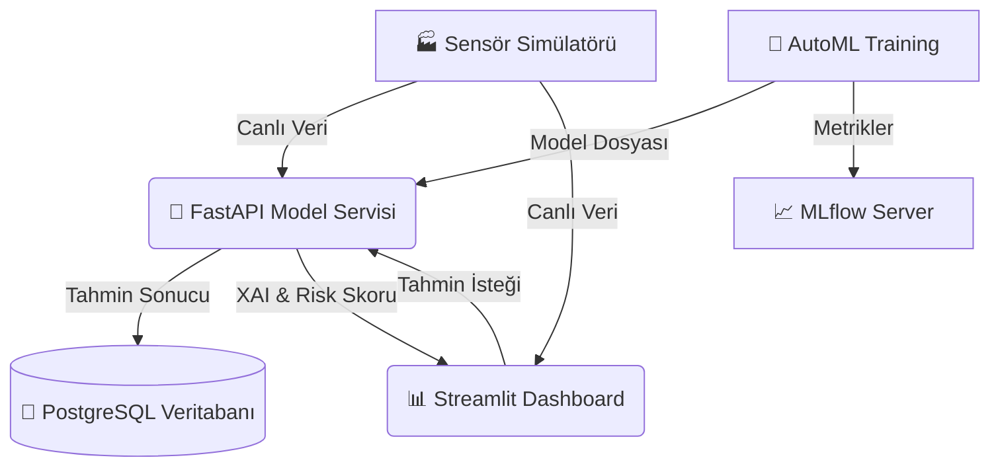

# 🏭 Manufacturing Analytics Project: AI-Powered Predictive Maintenance

[](https://www.python.org/)
[](https://streamlit.io/)
[](https://fastapi.tiangolo.com/)
[](https://www.docker.com/)
[](https://www.postgresql.org/)

**Endüstriyel Kestirimci Bakım (Predictive Maintenance)** için geliştirilmiş, uçtan uca, canlı veri simülasyonlu ve açıklanabilir yapay zeka (XAI) destekli tam teşekküllü bir sistemdir.

## 🌟 Öne Çıkan Özellikler

Bu proje, bir "Hobi" uygulamasından öte, **Kurumsal (Enterprise-Ready)** bir çözüm mimarisine sahiptir:

- **📡 Canlı İzleme & Simülasyon:** Gerçek zamanlı sensör verisi üreten simülatör ve anlık dashboard.
- **🧠 AutoML & Optuna:** Model hiperparametrelerini (ağaç derinliği, vb.) otomatik optimize eden akıllı eğitim süreci.
- **🔍 Açıklanabilir Yapay Zeka (XAI):** `SHAP` ile model kararlarının ("Neden Arıza Riski?") grafiksel izahı.
- **🗄️ Güçlü Hafıza (PostgreSQL):** Tüm tahminlerin ve sensör verilerinin kalıcı olarak saklandığı ilişkisel veritabanı.
- **📈 MLflow Takip Sistemi:** Her eğitimin performansını (Accuracy, F1 Score) kaydeden ve versiyonlayan MLOps altyapısı.
- **🐳 Tam Konteynerizasyon (Docker):** Tek komutla (`docker-compose up`) tüm sistemi (Dashboard + API + DB) ayağa kaldırma.
- **✅ Otomatik Testler:** Kod güvenilirliğini sağlayan `pytest` entegrasyonu.

## 🏗️ Sistem Mimarisi



## 🚀 Hızlı Başlangıç (Docker ile Kurulum)

Bilgisayarınızda **Docker Desktop** yüklü ise, projeyi çalıştırmak sadece 1 satır kod:

```bash
docker-compose up --build
```

Bu komut tamamlandığında şu hizmetler aktif olacaktır:
- **Dashboard:** [http://localhost:8501](http://localhost:8501) (Kullanıcı Arayüzü)
- **API Docs:** [http://localhost:8000/docs](http://localhost:8000/docs) (Swagger UI)
- **Veritabanı:** `localhost:5432` (PostgreSQL)

## 💻 Manuel Kurulum (Geliştirici Modu)

Eğer Docker kullanmadan, yerel Python ortamında çalıştırmak isterseniz:

1. **Bağımlılıkları Yükleyin:**
   ```bash
   pip install -r requirements.txt
   ```

2. **Veri Hazırlığı & Model Eğitimi:**
   ```bash
   python 01_ingestion.py          # Veriyi indir
   python 02_analysis_and_features.py # İşle
   python 03_machine_learning.py   # Modeli eğit (AutoML + MLflow)
   ```

3. **Uygulamayı Başlatın:**
   ```bash
   streamlit run 05_app.py
   ```
   *(Not: Manuel modda PostgreSQL yerine SQLite veya mock veri kullanılabilir, ancak tam özellikler için Docker önerilir.)*

## 📊 Ekran Görüntüleri

### 1. Canlı İzleme Paneli


> Anlık sensör verileri, risk durumu ve makine sağlığı grafiği.

### 2. XAI (SHAP) Analizi


> Modelin neden "Arıza Riski" uyarısı verdiğini gösteren detaylı analiz.

### 3. Geçmiş Raporlar


> Zaman içindeki risk değişimini gösteren trend grafiği ve veri tablosu.

## 🧪 Testleri Çalıştırma

Kodun sağlamlığını kontrol etmek için:

```bash
python -m pytest tests/
```

---
**License:** MIT
**Developer:** [Hasan Yiğit Doğanay]
